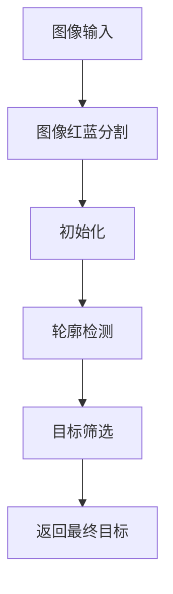
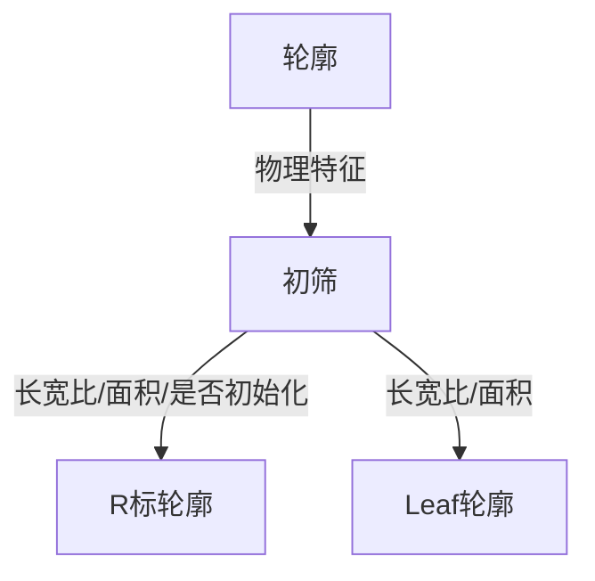
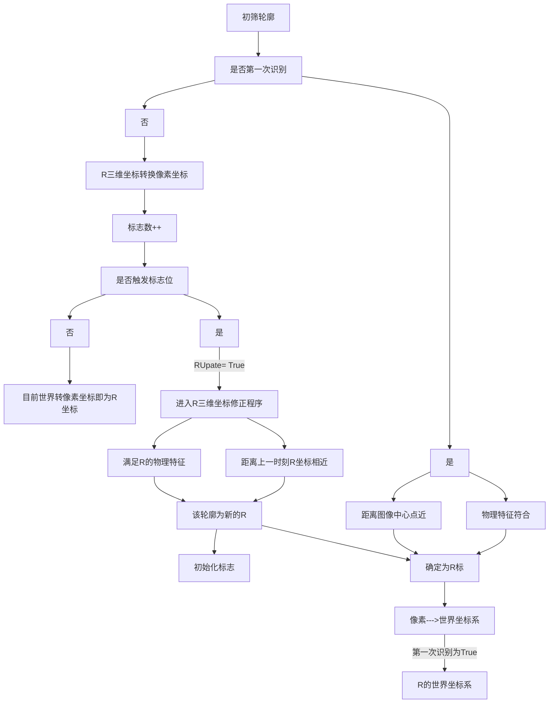
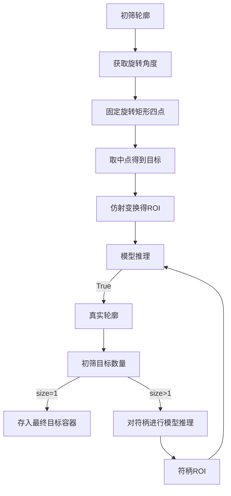

<center><h2>🚀 能量机关识别与预测（2024）</h2></center>


## 🎉 目录
1. [文件介绍](#🚀文件介绍)
2. [能量机关识别](#能量机关识别)
    - [1. 构造函数初始化参数](#1-构造函数初始化参数)
    - [2. 识别流程函数](#2-识别流程函数)
    - [3. 轮廓的识别](#3-轮廓的识别)
    - [4. R的识别流程](#4-对R的识别流程)
    - [5. Leaf识别](#5-对Leaf识别)
4. [能量机关预测](#能量机关预测)
 


## 🚀文件介绍

*参数配置文件*
```tree
├── SetParam_File
│   ├── Buff_data.yaml  //定义常量的值
│   ├── ...

```
*项目核心文件*

```tree
├── Buff_Detection                 // 识别
│   ├── buff_logs                  // 输出日志文件夹
│   ├── include
│   │   ├── BuffDetection.h        // 能量机关识别头文件
│   │   └── Logger.h               // 输出日志头文件包含函数（将数据以txt文件保存在指定文件夹---方面绘图可视化）
│   └── src
│       └── Buff_Detection.cpp     // 识别源文件
├── Buff_Prediction                // 预测
│   ├── include
│   │   └── BuffPrediction.h       // 预测头文件
│   └── src
│       └── Buff_Prediction.cpp    // 预测的源文件
```
<details>
<summary>功能包介绍</summary>
serial_device：串口通信功能包

robot_msgs：ROS自定义消息包

hik_camera：海康相机功能包

Model：模型集合包 (onnx模型)

public_include:：公共头文件包

robot_detection => SetParam_File：配置文件

robot_detection => AngleSolve：坐标系转换功能包

robot_detection => Armor_Detection：装甲板识别功能包

robot_detection => Armor_Track：装甲板跟踪功能包

robot_detection => Armor_Observe：整车观测功能包

robot_detection => Buff_Detection：能量机关识别功能包

robot_detection => Buff_Prediction：能量机关预测功能包

robot_detection => Neural_Armor_Detection：装甲板深度学习识别功能包

robot_detection => Neural_Buff_Detection：能量机关深度学习识别功能包

robot_detection =>  Outpost_Observe：反前哨站功能包

</details>

---
 
  

## 能量机关识别
### 1. 构造函数初始化参数

使用FileStorage类构造函数读取yaml文件数据，赋值于类定义的参数   
```
cv.FileStorage( source, flags， const string& encoding=string());

source –存储或读取数据的文件名（字符串），其扩展名(.xml 或 .yml/.yaml)决定文件格式。

flags – 操作模式，包括：
FileStorage::READ 打开文件进行读操作
FileStorage::WRITE 打开文件进行写操作
FileStorage::APPEND打开文件进行附加操作
FileStorage::MEMORY 从source读数据，或向内部缓存写入数据（由FileStorage::release返回）
```
<details>
<summary>ProjectCode</summary>

```c++
BuffDetection::BuffDetection()
{
    std::string package_path = ros::package::getPath("robot_detection");    // 通过ros获取路径
    cv::FileStorage fs(package_path + "/SetParam_File/Buff_data.yaml", cv::FileStorage::READ);  // 读取yaml文件

    //通道分离参数 红蓝各种阈值
    br_blue_threshold = (int) fs["br_blue_threshold"];   
    br_red_threshold = (int) fs["br_red_threshold"];

    rb_red_threshold = (int) fs["rb_red_threshold"];
    rb_blue_threshold = (int) fs["rb_blue_threshold"];

    //矩形 轮廓筛选部分参数
    r_min_area = (int) fs["r_min_area"];
    r_max_area = (int) fs["r_max_area"];

    leaf_min_area = (int) fs["leaf_min_area"];
    leaf_max_area = (int) fs["leaf_max_area"];

    //R标信息参数
    r_max_hb_ratio = (float) fs["r_max_hb_ratio"];  // 斜边和底边比率
    r_min_hb_ratio = (float) fs["r_min_hb_ratio"];

    r_max_hw_ratio = (float) fs["r_max_hw_ratio"];
    r_min_hw_ratio = (float) fs["r_min_hw_ratio"];

    R_ReInited_flag = (int) fs["R_ReInited_flag"];

    r_max_are_ratio = (double) fs["r_max_are_ratio"];
    r_min_are_ratio = (double) fs["r_min_are_ratio"];

    //leaf信息筛选参数
    leaf_max_hw_ratio = (float) fs["leaf_max_hw_ratio"];
    leaf_min_hw_ratio = (float) fs["leaf_min_hw_ratio"];

    leaf_r_max_distance = (int) fs["leaf_r_max_distance"];
    leaf_r_min_distance = (int) fs["leaf_r_min_distance"];


    //图像分类置信度评判
    leaf_classifier_confidence = (int) fs["leaf_classifier_confidence"];

    //R标图像匹配路径
    RModelPath = (std::string) fs["RModelPath"];
 
    // 分类模型路径赋值
    LeafModelPath = (std::string) fs["LeafModelPath"];
    HandleModelPath = (std::string) fs["HandleModelPath"];
 
    fs.release();
}
```
</details>

### 2. 识别流程函数



可以点开ProjectCode,里面有代码注释
<details>
<summary>ProjectCode</summary>


```c++

std::vector<BuffTarget> BuffDetection::Detection(cv::Mat &frame_) {

    /**
    * @brief 对图像初步增强、采用图像分割、膨胀和均值滤波 等
    * @param  加上膨胀、滤波操作时间消耗长
    * @return  返回二值化图像
    */


    SetImage(frame_);
 
    /**
     * @brief 对用到的变量开关/容器初始化
     */

    Detection_Init();
    /**
     * @brief 1.寻找初始轮廓 2.将符合初筛条件的轮廓 分别进入R 与 leaf 的筛选中
     * @param candidateRect_Buff结构体是在robot_struct定义的_将识别信息传到预测类里面
     * @return  返回容器finalBuff
     */

    findCandidateRect(binary);

    
    /**
       * @brief 应对可能出现两个目标（新目标已经出现，旧目标还没有来得及切换图案的时候）
       * @param 判断对于的位置与R标的距离
       * @return  Nullptr
       */
    Get_final_buff();

    /**
     * @brief 可视化数据
     */
    show(frame_);


#ifdef SHOW_IMAGE
    cv::imshow("frame_" , frame_);
    cv::imshow("binary",binary);

#endif
    
    return final_buff_target;

}
```
</details>

### 3. 轮廓的识别



### 4. 对R的识别流程


**注意**
- 第一次识别需要操作手手动将图像中心对准R标（才会进入识别）
- 只要第一次识别后且更新标志不为True 则只单纯使用坐标系转换得到像素坐标作为R标坐标
- **R的四个点坐标顺序对测距没影响且不是跟踪的事物，故不对坐标固定（但也可以固定）**


### 5. 对Leaf识别



#### 5.1 抽象介绍
概念：(如叶子)
- 符叶 leaf 
- 符柄 handle
- 目标 target

<details>
<summary>符叶的样子</summary>

 
</details>

 
 
