<center><h2>🚀 能量机关识别与预测（2024）</h2></center>


## 🎉 目录
1. [文件介绍](#🚀文件介绍)
2. [能量机关识别](#能量机关识别)
    - [1. 构造函数初始化参数](#1-构造函数初始化参数)
    - [2. 识别流程函数](#2-识别流程函数)
    - [3. 轮廓的识别](#3-轮廓的识别)
    - [4. R的识别流程](#4-对R的识别流程)
    - [5. Leaf识别](#5-对Leaf识别)
        - [5.0 计算角度](#5-0-计算角度)
        - [5.1 抽象概念介绍](#5-1-抽象概念介绍)
        - [5.2 固定坐标](#5-2-固定坐标)
        - [5.3 目标](#5-3-目标)
3. [能量机关预测](#能量机关预测)
## 🚀文件介绍

*参数配置文件*
```tree
├── SetParam_File
│   ├── Buff_data.yaml  //定义常量的值
│   ├── ...

```
*项目核心文件*

```tree
├── Buff_Detection                 // 识别
│   ├── buff_logs                  // 输出日志文件夹
│   ├── include
│   │   ├── BuffDetection.h        // 能量机关识别头文件
│   │   └── Logger.h               // 输出日志头文件包含函数（将数据以txt文件保存在指定文件夹---方面绘图可视化）
│   └── src
│       └── Buff_Detection.cpp     // 识别源文件
├── Buff_Prediction                // 预测
│   ├── include
│   │   └── BuffPrediction.h       // 预测头文件
│   └── src
│       └── Buff_Prediction.cpp    // 预测的源文件
```
<details>
<summary>功能包介绍</summary>
serial_device：串口通信功能包

robot_msgs：ROS自定义消息包

hik_camera：海康相机功能包

Model：模型集合包 (onnx模型)

public_include:：公共头文件包

robot_detection => SetParam_File：配置文件

robot_detection => AngleSolve：坐标系转换功能包

robot_detection => Armor_Detection：装甲板识别功能包

robot_detection => Armor_Track：装甲板跟踪功能包

robot_detection => Armor_Observe：整车观测功能包

robot_detection => Buff_Detection：能量机关识别功能包

robot_detection => Buff_Prediction：能量机关预测功能包

robot_detection => Neural_Armor_Detection：装甲板深度学习识别功能包

robot_detection => Neural_Buff_Detection：能量机关深度学习识别功能包

robot_detection =>  Outpost_Observe：反前哨站功能包

</details>

---
 
  

## 能量机关识别
### 1. 构造函数初始化参数

使用FileStorage类构造函数读取yaml文件数据，赋值于类定义的参数   
```
cv.FileStorage( source, flags， const string& encoding=string());

source –存储或读取数据的文件名（字符串），其扩展名(.xml 或 .yml/.yaml)决定文件格式。

flags – 操作模式，包括：
FileStorage::READ 打开文件进行读操作
FileStorage::WRITE 打开文件进行写操作
FileStorage::APPEND打开文件进行附加操作
FileStorage::MEMORY 从source读数据，或向内部缓存写入数据（由FileStorage::release返回）
```
<details>
<summary>ProjectCode</summary>

```c++
BuffDetection::BuffDetection()
{
    std::string package_path = ros::package::getPath("robot_detection");    // 通过ros获取路径
    cv::FileStorage fs(package_path + "/SetParam_File/Buff_data.yaml", cv::FileStorage::READ);  // 读取yaml文件

    //通道分离参数 红蓝各种阈值
    br_blue_threshold = (int) fs["br_blue_threshold"];   
    br_red_threshold = (int) fs["br_red_threshold"];

    rb_red_threshold = (int) fs["rb_red_threshold"];
    rb_blue_threshold = (int) fs["rb_blue_threshold"];

    //矩形 轮廓筛选部分参数
    r_min_area = (int) fs["r_min_area"];
    r_max_area = (int) fs["r_max_area"];

    leaf_min_area = (int) fs["leaf_min_area"];
    leaf_max_area = (int) fs["leaf_max_area"];

    //R标信息参数
    r_max_hb_ratio = (float) fs["r_max_hb_ratio"];  // 斜边和底边比率
    r_min_hb_ratio = (float) fs["r_min_hb_ratio"];

    r_max_hw_ratio = (float) fs["r_max_hw_ratio"];
    r_min_hw_ratio = (float) fs["r_min_hw_ratio"];

    R_ReInited_flag = (int) fs["R_ReInited_flag"];

    r_max_are_ratio = (double) fs["r_max_are_ratio"];
    r_min_are_ratio = (double) fs["r_min_are_ratio"];

    //leaf信息筛选参数
    leaf_max_hw_ratio = (float) fs["leaf_max_hw_ratio"];
    leaf_min_hw_ratio = (float) fs["leaf_min_hw_ratio"];

    leaf_r_max_distance = (int) fs["leaf_r_max_distance"];
    leaf_r_min_distance = (int) fs["leaf_r_min_distance"];


    //图像分类置信度评判
    leaf_classifier_confidence = (int) fs["leaf_classifier_confidence"];

    //R标图像匹配路径
    RModelPath = (std::string) fs["RModelPath"];
 
    // 分类模型路径赋值
    LeafModelPath = (std::string) fs["LeafModelPath"];
    HandleModelPath = (std::string) fs["HandleModelPath"];
 
    fs.release();
}
```
</details>

### 2. 识别流程函数

``` mermaid
graph TD;
    A[图像输入] --> B[图像红蓝分割];
    B --> C[初始化];
    C --> D[轮廓检测];
    D --> E[目标筛选];
    E --> F[返回最终目标]
```



可以点开ProjectCode,里面有代码注释
<details>
<summary>ProjectCode</summary>


```c++

std::vector<BuffTarget> BuffDetection::Detection(cv::Mat &frame_) {

    /**
    * @brief 对图像初步增强、采用图像分割、膨胀和均值滤波 等
    * @param  加上膨胀、滤波操作时间消耗长
    * @return  返回二值化图像
    */


    SetImage(frame_);
 
    /**
     * @brief 对用到的变量开关/容器初始化
     */

    Detection_Init();
    /**
     * @brief 1.寻找初始轮廓 2.将符合初筛条件的轮廓 分别进入R 与 leaf 的筛选中
     * @param candidateRect_Buff结构体是在robot_struct定义的_将识别信息传到预测类里面
     * @return  返回容器finalBuff
     */

    findCandidateRect(binary);

    
    /**
       * @brief 应对可能出现两个目标（新目标已经出现，旧目标还没有来得及切换图案的时候）
       * @param 判断对于的位置与R标的距离
       * @return  Nullptr
       */
    Get_final_buff();

    /**
     * @brief 可视化数据
     */
    show(frame_);


#ifdef SHOW_IMAGE
    cv::imshow("frame_" , frame_);
    cv::imshow("binary",binary);

#endif
    
    return final_buff_target;

}
```
</details>

### 3. 轮廓的识别

``` mermaid
graph TD;
    A[轮廓] -->|物理特征| B[初筛];
    B--> |长宽比/面积/是否初始化|C[R标轮廓];
    B--> |长宽比/面积| D[Leaf轮廓];

```



### 4. 对R的识别流程

```mermaid
graph TD;
    A[初筛轮廓];
    B[初始化标志];
    C[像素--->世界坐标系];
    D[是否第一次识别];
    E[距离图像中心点近];
    F[物理特征符合];
    G[是];
    H[否];
    A-->D;
    D-->G;
    D-->H;
    G-->E;
    G-->F;
    I[确定为R标];
    F --> I;
    E --> I;
    I-->C;
    C-->|第一次识别为True|A1[R的世界坐标系]

    H-->H1[R三维坐标转换像素坐标]
    H1-->H2[标志数++]
    H2-->H3[是否触发标志位]
    H3-->H4[是]
    H3-->H5[否]
    H5-->F1[目前世界转像素坐标即为R坐标]
    H4 -->|RUpate= True|H6[进入R三维坐标修正程序]
    H6 --> H7[距离上一时刻R坐标相近]
    H6 --> H8[满足R的物理特征]
    H7 --> H9[该轮廓为新的R]
    H9 -->B
    H9 -->I
    H8 -->H9
```


**注意**
- 第一次识别需要操作手手动将图像中心对准R标（才会进入识别）
- 只要第一次识别后且更新标志不为True 则只单纯使用坐标系转换得到像素坐标作为R标坐标
- **R的四个点坐标顺序对测距没影响且不是跟踪的事物，故不对坐标固定（但也可以固定）**


### 5. 对Leaf识别

```mermaid
graph TD;
    A[初筛轮廓]
    B[获取旋转角度]
    C[固定旋转矩形四点]
    D[取中点得到目标]
    E[仿射变换得ROI]
    F[模型推理]
    G[真实轮廓]
    H[初筛目标数量]
    I[存入最终目标容器]
    J[对符柄进行模型推理]
    K[符柄ROI]
    A --> B;
    B --> C;
    C --> D;
    D --> E;
    E --> F;
    F --> |True|G;
    G --> H;
    H --> |size=1|I ;
    H --> |size>1|J;
    J --> K;
    K --> F;
```



#### 5.0 计算角度

计算两个向量之间夹角的函数
给定三个点 `pt1(x1, y1)`, `pt2(x2, y2)`, `pt0(x0, y0)` 

步骤：
1. 向量点积公式
2. 计算两个向量的夹角余弦
3. 反余弦算夹角
4. 角度范围调整（根据点 pt0.y 和 pt1.y 的相对位置，对角度范围进行调整）
<details>
<summary>具体代码</summary>

```c++
float BuffDetection::getAngle(cv::Point2f pt1, cv::Point2f pt2, cv::Point2f pt0, std::string mode) {
    float _circleAngle360, _circleAngle180;
    float dx1 = pt1.x - pt0.x;
    float dy1 = pt1.y - pt0.y;
    float dx2 = pt2.x - pt0.x;
    float dy2 = pt2.y - pt0.y;
    float angle_line = (dx1 * dx2 + dy1 * dy2) / sqrtf((dx1 * dx1 + dy1 * dy1) * (dx2 * dx2 + dy2 * dy2) + 1e-10f);
    _circleAngle180 = acosf(angle_line) * 180.0f / 3.141592653f;

    if (pt0.y < pt1.y) {
        _circleAngle360 = 360.0f - _circleAngle180;
        _circleAngle180 = -_circleAngle180;
    } else {
        _circleAngle360 = _circleAngle180;
    }
    if (mode == "360") { return _circleAngle360; }
    else { return _circleAngle180; }
}
```
</details>


#### 5.1 抽象概念介绍
概念：(如叶子)
- 符叶 leaf 
- 符柄 handle
- 目标 target

<details>
<summary>符叶的样子</summary>


</details>
<details>
<summary>符柄的样子</summary>


</details>
<details>
<summary>目标 target</summary>

</details>


#### 5.2 固定坐标 

Qustion: 🤔为什么需要固定坐标?

Answer: **因为符是旋转的，而是使用旋转矩形后，随着角度变化，符叶四个点会发生变化。方便后期仿射变换得到要求的ROI图像**


**坐标顺序（当前代码以图1为正参照）**

- leaf_target[0]        左下
- leaf_target[1]        左上
- leaf_target[2]        右上
- leaf_target[3]        右下

<div style="text-align: center;">
    
    
</div>


<details>
<summary>对应代码</summary>

```c++
if (leaf_.angle >= 0 && leaf_.angle < 91 || leaf_.angle >= 353 && leaf_.angle <= 360) {
            leaf_target[0] = Vertex[0];
            leaf_target[1] = Vertex[1];
            leaf_target[2] = Vertex[2];
            leaf_target[3] = Vertex[3];

        } else if (leaf_.angle >= 91 && leaf_.angle < 181) {
            leaf_target[0] = Vertex[3];
            leaf_target[1] = Vertex[0];
            leaf_target[2] = Vertex[1];
            leaf_target[3] = Vertex[2];

        } else if (leaf_.angle >= 181 && leaf_.angle < 266) {
            leaf_target[0] = Vertex[2];
            leaf_target[1] = Vertex[3];
            leaf_target[2] = Vertex[0];
            leaf_target[3] = Vertex[1];

        } else {
            leaf_target[0] = Vertex[1];
            leaf_target[1] = Vertex[2];
            leaf_target[2] = Vertex[3];
            leaf_target[3] = Vertex[0];
        }
```

**为什么不是0 90 180 270 这样固定。自己可以试试看。毕竟这都是测出来的，大概是跟分辨率不是正比例有关系吧**

</details>


#### 5.3 模型推理
>该分类器的实现基于 OpenCV 的 DNN（深度神经网络）模块来加载和推理 ONNX 模型，并返回一个布尔值

``` mermaid
graph TD;
    A[模型加载]
    B[图像转换为blob（四维数组）]
    C[设置网络的输入]
    D[前向传播forward]
    E[找到最高概率的类别]
    F[分类判断]
    G[释放内存,返回结果]
    A -->B;
    B --> C;
    C --> D;
    D --> D1[输出prob表示类别的概率分布]
    D --> E;
    E --> F;
    F --> G;

```




<details>
<summary>模型推理代码</summary>

```c++
bool BuffDetection::classifier(cv::Mat &src, size_t id, std::string &ModePath) {
    double confidence;
    size_t classId;
    // 加载ONNX模型

    cv::dnn::Net net = cv::dnn::readNetFromONNX(ModePath);

    // 将图像转换为blob
    cv::Mat blob = cv::dnn::blobFromImage(src, 1.0, cv::Size(30, 30), cv::Scalar(), true, false);

    // 设置网络的输入
    net.setInput(blob);

    // 进行前向传播以获取输出
    cv::Mat prob = net.forward();

    // 找到概率最高的类别
    cv::Point classIdPoint;
    minMaxLoc(prob.reshape(1, 1), nullptr, &confidence, nullptr, &classIdPoint);

    classId = classIdPoint.x;

    if (classId == id && confidence * 100 > leaf_classifier_confidence) {
        blob.release();
        prob.release();
        return true;
    } else {

        blob.release();
        prob.release();
        return false;
    }
}
```
</details>


#### 5.3 目标

**5.3.1目标的点顺序（固定）**

<div style="text-align: center;">
    
    
</div>

**5.3.2目标干扰**

<span style="color: red;">1.打中十环后的图案和目标图案是非常相似的,使用要使用符柄进行二筛。</span>


<span style="color: red;">2.出现两个目标进行二筛。</span>


---

## 能量机关预测
<video width="100%" height="80%" controls>
  <source src="https://github.com/user-attachments/assets/6f0700aa-6c86-446e-a70a-2b5157fbbb08" type="video/mp4">
</video>


### 1.小能量机关预测

固定预测角度就行。没啥难度...


### 2.大能量机关预测

此方案参考了[西安电子科技大学-IRobot战队能量机关拟合部分](https://github.com/SanZoom/RM2022-Infantry-Vision/blob/master/src/Rune/Fitting.cpp),感谢提供思路！
此外数据预测处理部分参考了[桂林电子科技大学Evolution战队](https://github.com/freezing00/Baldr/blob/main/Src/angle/CoordinateSolver/BuffCoordinateSolver.cpp),感谢提供思路！
